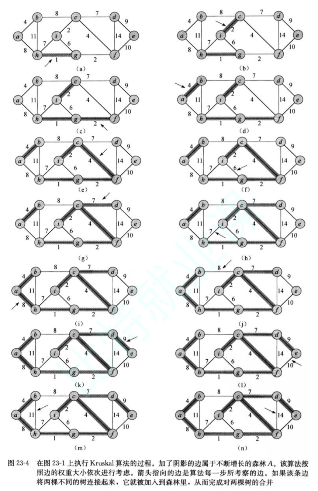
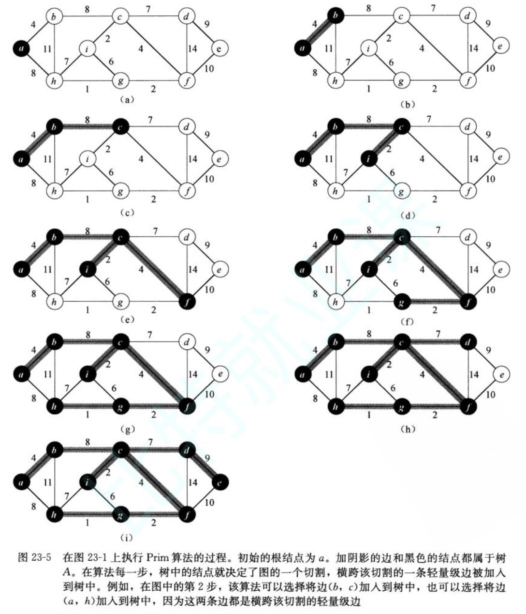
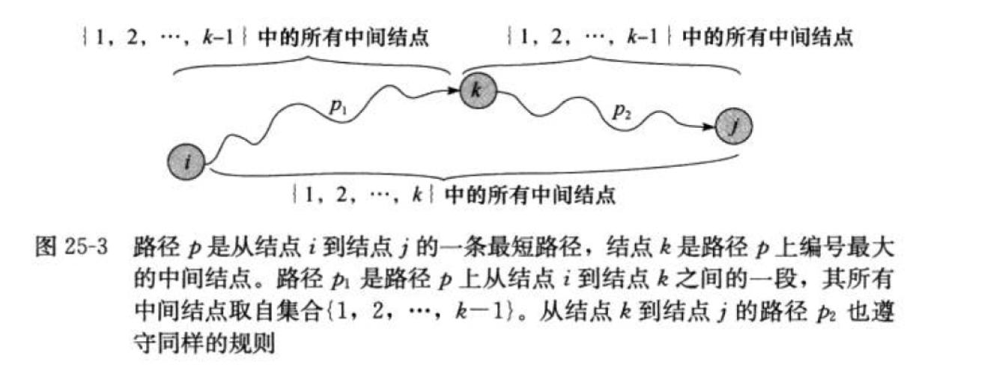

# 图

1. 图的基本概念

2. 图的存储结构

3. 图的遍历

4. 最小生成树

5. 最短路径

## 图的基本概念

一般表示成 G = (V, E)。

## 图的表示方法

1. 邻接矩阵

2. 邻接表

### 邻接矩阵

邻接矩阵存储方式非常适合稠密图。邻接矩阵可以O(1)判断两个顶点的连接关系，并拿到权值。

邻接矩阵不适合用来查找，一个顶点连接的所有边，这个是O(n)的。

邻接矩阵的表示：

```cpp
namespace yufc_graph_matrix
{
    template <class vertex_type, class weight_type, weight_type __max_weight = INT_MAX, bool direction = false>
    class graph
    {
    private:
        std::vector<vertex_type> __vertexs;             // 顶点的集合
        std::map<vertex_type, int> __index_map;         // 顶点映射的下标
        std::vector<std::vector<weight_type>> __matrix; // 邻接矩阵
    public:
        // 图的创建
        /*
            三种创建图的方法：
            1. IO输入 -- 不方便测试，oj中更合适
            2. 图结构关系写到文件，读取文件
            3. 手动添加边
        */
        graph(const vertex_type *a, size_t n)
        {
            __vertexs.reserve(n);
            for (size_t i = 0; i < n; i++)
            {
                __vertexs.push_back(a[i]); // 每个顶点存进去
                __index_map[a[i]] = i;     // 顶点映射的下标，就是这个顶点是__vertexs中哪一个下标上的
            }
            __matrix.resize(n);
            for (size_t i = 0; i < __matrix.size(); ++i)
            {
                __matrix[i].resize(n, __max_weight);
            }
        }
        size_t get_vertex_index(const vertex_type &v)
        {
            /* 确定顶点的下标 */
            auto it = __index_map.find(v);
            if (it != __index_map.end())
                return it->second;
            else
            {
                throw std::invalid_argument("vertex not exists");
                return -1;
            }
        }
        void add_edge(const vertex_type &src, const vertex_type &dest, const weight_type &weight)
        {
            size_t srci = get_vertex_index(src);
            size_t desti = get_vertex_index(dest);
            __matrix[srci][desti] = weight;
            // 如果是无向图
            if (direction == false)
                __matrix[desti][srci] = weight;
        }

    public:
        void print()
        {
            // 把顶点打印出来
            for (size_t i = 0; i < __vertexs.size(); i++)
                std::cout << "[" << i << "]"
                          << "->" << __vertexs[i] << std::endl;
            std::cout << std::endl;
            // 打印一下矩阵
            // 先打印一下下标
            std::cout << "  ";
            for (size_t i = 0; i < __vertexs.size(); ++i)
                std::cout << i << " ";
            std::cout << std::endl;
            for (size_t i = 0; i < __matrix.size(); ++i)
            {
                // 先打印一下下标
                std::cout << i << " ";
                for (size_t j = 0; j < __matrix[i].size(); ++j)
                    if (__matrix[i][j] == __max_weight)
                        std::cout << "* ";
                    else
                        std::cout << __matrix[i][j] << " ";
                std::cout << std::endl;
            }
        }
    };
}
```

### 邻接表

邻接表是一个指针数组，把自己连接的顶点都挂在下面。

适合存储稀疏图。适合查找一个顶点连接出去的边。

不适合确定两个顶点是否相连，及其权值

邻接表的表示：

```cpp
namespace yufc_graph_link_table
{
    template <class weight_type>
    struct edge
    {
        int __dest_idx;            // 目标点的下标
        weight_type __weight;      // 权值
        edge<weight_type> *__next; // 链接指针
        edge(int desti, const weight_type &weight)
            : __dest_idx(desti), __weight(weight), __next(nullptr) {}
    };
    template <class vertex_type, class weight_type, bool direction = false>
    class graph
    {
    private:
        typedef edge<weight_type> Edge;
        std::vector<vertex_type> __vertexs;     // 顶点的集合
        std::map<vertex_type, int> __index_map; // 顶点映射的下标
        std::vector<Edge *> __table;            // 下面挂边
    public:
        graph(const vertex_type *a, size_t n)
        {
            __vertexs.reserve(n);
            for (size_t i = 0; i < n; i++)
            {
                __vertexs.push_back(a[i]); // 每个顶点存进去
                __index_map[a[i]] = i;     // 顶点映射的下标，就是这个顶点是__vertexs中哪一个下标上的
            }
            // 初始化邻接表
            __table.resize(n, nullptr);
        }
        size_t get_vertex_index(const vertex_type &v)
        {
            /* 确定顶点的下标 */
            auto it = __index_map.find(v);
            if (it != __index_map.end())
                return it->second;
            else
            {
                throw std::invalid_argument("vertex not exists");
                return -1;
            }
        }
        void add_edge(const vertex_type &src, const vertex_type &dest, const weight_type &weight)
        {
            size_t srci = get_vertex_index(src);
            size_t desti = get_vertex_index(dest);
            Edge *eg = new Edge(desti, weight);
            // 头插
            eg->__next = __table[srci];
            __table[srci] = eg;
            if (direction == false)
            {
                // 无向图反过来还要弄一下才行
                Edge *eg = new Edge(srci, weight);
                eg->__next = __table[desti];
                __table[desti] = eg;
            }
        }

    public:
        void print()
        {
            // 把顶点打印出来
            for (size_t i = 0; i < __vertexs.size(); i++)
                std::cout << "[" << i << "]"
                          << "->" << __vertexs[i] << std::endl;
            std::cout << std::endl;
            //
            for (size_t i = 0; i < __table.size(); ++i)
            {
                std::cout << __vertexs[i] << "[" << i << "]->";
                Edge *cur = __table[i]; // 遍历一下单链表而已
                while (cur)
                {
                    std::cout << cur->__weight << "->" << __vertexs[cur->__dest_idx] << "[" << cur->__dest_idx << "]->";
                    cur = cur->__next;
                }
                std::cout << "nullptr" << std::endl;
            }
        }
    };
}
```


### 图的一些相关概念

完全图：在有n个顶点的无向图中，若有$n*(n-1)/2$条边，即任意两个顶点之间有且仅有一条边，则称此图为无向完全图。在n个顶点的有向图中，若有$n*(n-1)$条边，即任意两个顶点之间有且仅有方向相反的边，则称此图为有向完全图。

邻接顶点：在无向图中G中，若(u, v)是E(G)中的一条边，则称u和v互为邻接顶点，并称边(u,v)依附于顶点u和v;在有向图G中，若`<u, v>`是E(G)中的一条边，则称顶点u邻接到v，顶点v邻接自顶点u，并称边`<u, v>`与顶点u和顶点v相关联。

顶点的度：顶点v的度是指与它相关联的边的条数，记作deg(v)。在有向图中，顶点的度等于该顶点的入度与出度之和，其中顶点v的入度是以v为终点的有向边的条数，记作`indev(v)`;顶点v的出度 是以v为起始点的有向边的条数，记作`outdev(v)`。因此:`dev(v) = indev(v) + outdev(v)`。注意：对于无向图，顶点的度等于该顶点的入度和出度，即`dev(v) = indev(v) = outdev(v)`。

路径：在图G = (V, E)中，若从顶点vi出发有一组边使其可到达顶点vj，则称顶点vi到顶点vj的顶 点序列为从顶点vi到顶点vj的路径。

路径长度：对于不带权的图，一条路径的路径长度是指该路径上的边的条数；对于带权的图，一条路径的路径长度是指该路径上各个边权值的总和。

简单路径与回路：若路径上各顶点v1，v2，v3，...，vm均不重复，则称这样的路径为简单路径。若路径上第一个顶点v1和最后一个顶点vm重合，则称这样的路径为回路或环。

子图:设图G = {V, E}和图G1 = {V1，E1}，若V1属于V且E1属于E，则称G1是G的子图。

连通图：在无向图中，若从顶点v1到顶点v2有路径，则称顶点v1与顶点v2是连通的。如果图中任意一对顶点都是连通的，则称此图为连通图。

强连通图：在有向图中，若在每一对顶点vi和vj之间都存在一条从vi到vj的路径，也存在一条从vj到vi的路径，则称此图是强连通图。

生成树：一个连通图的最小连通子图称作该图的生成树。有n个顶点的连通图的生成树有n个顶点和n-1条边。


**#BUG: 0206发现潜在问题：如果一直给无向图add_edge，重复的边权值矛盾了怎么处理，要记得处理一下（还未处理）**

## 图的遍历

两种遍历针对的都是图的顶点。

然后下面的代码先用了邻接矩阵的方式来实现了，不过用邻接表也是一样的，自行改一下就行，主要是思路而已。

### bfs

广度优先遍历，然后我们都用这个图。


第一次先把A入队列。

此时队列为：`A`

然后A出来，把和A相连的带进来（BCD）。

此时队列为：`B C D`

此时B出来，把和B相连的带进来，和B相连的有E，C，A。不用说，E肯定是要进来的，AC进不进队列呢？

A不要进了，C可以进，因为此时C还没有被访问过。这时候虽然队列里面有两个C，但是也没问题，到时候的访问过的节点，不要再去访问就行了。

然后怎么标记呢，可以用一个set去记录一下下标（元素可能是其他类型，不好搞，所以就记录下标就行了）

**当然可以不这样标记也可以，我们可以把进队列的标记一下，这样效率高一点**

代码如下所示：
```cpp
void bfs(const vertex_type &src)
{
    // 需要给一个起点
    size_t srci = get_vertex_index(src); // 找到起点的下标
    std::queue<int> q;
    std::vector<bool> visited(__vertexs.size(), false); // 所有顶点一开始先标记成false
    q.push(srci);                                       // 起点入队列
    visited[srci] = true;                               // 标记起点，因为起点已经入队列了
    while (!q.empty())
    {
        // 队列不为空就继续遍历
        int front = q.front();                                             // 队头的数据
        std::cout << __vertexs[front] << "[" << front << "]" << " "; // 访问这个值
        q.pop();
        // 把和front相连的顶点入队
        for (size_t i = 0; i < __vertexs.size(); ++i)
        {
            if (__matrix[front][i] != __max_weight && visited[i] == false)
            {
                q.push(i);         // 和当前顶点相连的节点
                visited[i] = true; // 入队列的，标记一下
            }
        }
    }
    std::cout << std::endl << "bfs done!" << std::endl;
}
```
输出：
```
A[0] B[1] C[2] D[3] E[4] F[5] G[6] H[7] I[8] 
bfs done!
```
这个也符合我们的预期。

同时，我们也可以给这个bfs进行改进，因为做力扣的时候是有一个二叉树的层序遍历的题目的，如果我想知道每一层分别是什么，我们在代码中也可以控制，下面是改进后的版本。


```cpp
// 遍历
void bfs(const vertex_type &src)
{
    // 需要给一个起点
    size_t srci = get_vertex_index(src); // 找到起点的下标
    std::queue<int> q;
    std::vector<bool> visited(__vertexs.size(), false); // 所有顶点一开始先标记成false
    q.push(srci);                                       // 起点入队列
    visited[srci] = true;                               // 标记起点，因为起点已经入队列了
    int levelSize = 1;
    while (!q.empty())
    {
        // 控制一次出一层
        for (size_t i = 0; i < levelSize; i++)
        {
            // 队列不为空就继续遍历
            int front = q.front(); // 队头的数据
            std::cout << __vertexs[front] << "[" << front << "]"
                        << " "; // 访问这个值
            q.pop();
            // 把和front相连的顶点入队
            for (size_t i = 0; i < __vertexs.size(); ++i)
            {
                if (__matrix[front][i] != __max_weight && visited[i] == false)
                {
                    q.push(i);         // 和当前顶点相连的节点
                    visited[i] = true; // 入队列的，标记一下
                }
            }
        }
        std::cout << std::endl; // 出完每一层才去换行
        levelSize = q.size();   // 此时levelSize就是下一层个数，就是现在队列的元素个数，因为我们已经把当前层出完了，剩下的都是下一层的
    }
    std::cout << "bfs done!" << std::endl;
}
```
输出：
```
A[0] 
B[1] C[2] D[3] 
E[4] F[5] 
G[6] H[7] 
I[8] 
bfs done!
```
这样的结果也是符合预期的。

### dfs

深度优先遍历。

深度优先遍历可以用递归。

```cpp
void __dfs(size_t srci, std::vector<bool>& visited)
{
    
}
void dfs(const vertex_type &src)
{
    size_t srci = get_vertex_index(src);
}
```
肯定就要写一个子函数了，因为从A开始走要转化成从B开始走，从C开始走...

然后带上一个visited数组就行，记录哪些点是走过的。

完成后的代码如下所示：
```cpp
void __dfs(size_t srci, std::vector<bool> &visited)
{
    std::cout << __vertexs[srci] << "[" << srci << "]" << " ";
    visited[srci] = true; // 标记访问过了
    // 找一个srci相邻的，没有访问过的点去往深度遍历
    for (size_t i = 0; i < __vertexs.size(); ++i)
        if (__matrix[srci][i] != __max_weight && visited[i] == false) // 遍历矩阵里面有连接的点就行
            __dfs(i, visited);
}
void dfs(const vertex_type &src)
{
    size_t srci = get_vertex_index(src);
    std::vector<bool> visited(__vertexs.size(), false);
    __dfs(srci, visited);
    std::cout << std::endl << "dfs done" << std::endl;
}
```
输出结果：
```
A[0] B[1] C[2] F[5] D[3] H[7] I[8] E[4] G[6] 
dfs done
```
这个结果，看图，也是符合我们dfs预期的

### 如果给的图不是连通图？

如果给的图不是连通图？以某个点为起点就不能遍历完成，那么怎么保证遍历完剩下的点？

- 在visited数组找没有遍历过的点然后再去遍历就行了

## 最小生成树

一定是在连通图中找生成树。

连通图中的每一棵生成树，都是原图的一个极大无环子图，即：从其中删去任何一条边，生成树就不再连通

反之，在其中引入任何一条新边，都会形成一条回路。 

若连通图由n个顶点组成，则其生成树必含n个顶点和n-1条边。因此构造最小生成树的准则有三条:

1. 只能使用图中的边来构造最小生成树

2. 只能使用恰好n-1条边来连接图中的n个顶点 

3. 选用的n-1条边不能构成回路

构造最小生成树的方法: Kruskal算法和Prim算法。这两个算法都采用了逐步求解的贪心策略。

- 贪心算法:是指在问题求解时，总是做出当前看起来最好的选择。也就是说贪心算法做出的不是整体最优的的选择，而是某种意义上的局部最优解。

- 贪心算法不是对所有的问题都能得到整体最优解。

### Kruskal算法

任给一个有n个顶点的连通网络$N=\{V,E\}$

首先构造一个由这n个顶点组成、不含任何边的图$G=\{V,NULL\}$，其中每个顶点自成一个连通分量。

其次不断从E中取出权值最小的一条边(若有多条任取其一)，若该边的两个顶点来自不同的连通分量，则将此边加入到G中。如此重复，直到所有顶点在同一个连通分量上为止。

**核心：每次迭代时，选出一条具有最小权值，且两端点不在同一连通分量上的边，加入生成树。**

那怎么判断新加入的边是否会构成环呢？并查集就行了。

如果新加入的边的两个顶点已经属于同一个并查集了，那么这两个点已经连通，因此这条新的边不能加入到生成树当中。

我们直接看例子，这个例子是我在《算法导论》上截取下来的例子。



下面就是代码实现。

**这里的测试用例，使用的是算法导论上面这张图的例子进行测试的。**

```cpp
// 最小生成树
weight_type Kruskal(self &minTree)
{
    // 要先初始化最小生成树
    size_t n = __vertexs.size();
    minTree.__vertexs = this->__vertexs;
    minTree.__index_map = this->__index_map;
    minTree.__matrix.resize(n);
    for (size_t i = 0; i < n; i++)
        minTree.__matrix[i].resize(n, __max_weight);
    assert(direction == false); // 只能无向图
    // 如果有最小生成树，就返回到minTree里面，如果没有，就返回一个默认的weight_type
    // 然后比较边，优先队列要重载一个比较才行
    std::priority_queue<__edge, std::vector<__edge>, std::greater<__edge>> minq;
    for (size_t i = 0; i < n; i++)
        for (size_t j = 0; j < n; j++)
            if (i < j && __matrix[i][j] != __max_weight) // 表示有这条边，那就把这条边加入到优先队列中, i<j 可以保证无向图不会重复添加边
                minq.push(__edge(i, j, __matrix[i][j]));
    // 找到最小的边，依次添加
    int size = 0;                             // 选出n-1条边就行了
    weight_type total_weight = weight_type(); // 总的权值
    union_find_disjoint_set<int> ufs(n); // 这里不能用size_t
    while (!minq.empty())
    {
        __edge min = minq.top(); // 选出一条边
        minq.pop();
        if (ufs.InSet(min.__srci, min.__dsti))
            continue;                                             // 如果这个边的两个顶点在一个集合里面，直接跳过本轮
        minTree.__add_edge(min.__srci, min.__dsti, min.__weight); // 添加边就行了
        ufs.Union(min.__srci, min.__dsti);
        size++;
        total_weight += min.__weight;
    }
    if (size == n - 1)
        return total_weight;
    else
        return weight_type(); // 如果找不到，就返回一个缺省值
}
```

这个输出也是没有问题的，符合预期。

```
Kruskal:37
[0]->a
[1]->b
[2]->c
[3]->d
[4]->e
[5]->f
[6]->g
[7]->h
[8]->i

  0 1 2 3 4 5 6 7 8 
0 * 4 * * * * * 8 * 
1 4 * * * * * * * * 
2 * * * 7 * 4 * * 2 
3 * * 7 * 9 * * * * 
4 * * * 9 * * * * * 
5 * * 4 * * * 2 * * 
6 * * * * * 2 * 1 * 
7 8 * * * * * 1 * * 
8 * * 2 * * * * * *
```

当然，如果想看选边的过程，也是在代码中打印出来，就能看到了。

### Prim算法

与Kruskal算法类似。Prim算法的工作原理与Dijkstra的最短路径算法相似。Prim算法所具有的一个性质是集合A中的边总是构成一棵树。如图所示，还是这个图，这棵树从一个任意的根结点r开始，一直长大到覆盖V中的所有结点时为止。算法每一步在连接集合A和A之外的结点的所有边中，选择一条轻量级边加入到A中。这条规则所加入的边都是对A安全的边。因此，当算法终止时，A中的边形成一棵最小生成树。本策略也属于贪心策略，因为每一步所加人的边都必须是使树的总权重增加量最小的边。



Prim算法代码：

```cpp
weight_type Prim(self &minTree, const weight_type &src)
{
    size_t srci = get_vertex_index(src);
    size_t n = __vertexs.size();
    minTree.__vertexs = __vertexs;
    minTree.__index_map = __index_map;
    minTree.__matrix.resize(n);
    for (size_t i = 0; i < n; ++i)
    {
        minTree.__matrix[i].resize(n, __max_weight);
    }
    std::vector<bool> X(n, false);
    std::vector<bool> Y(n, true);
    X[srci] = true;
    Y[srci] = false;
    // 从X->Y集合中连接的边里面选出最小的边
    std::priority_queue<__edge, std::vector<__edge>, std::greater<__edge>> minq;
    // 先把srci连接的边添加到队列中
    for (size_t i = 0; i < n; ++i)
        if (__matrix[srci][i] != __max_weight)
            minq.push(__edge(srci, i, __matrix[srci][i]));

    // std::cout << "Prim开始选边" << std::endl;
    size_t size = 0;
    weight_type totalW = weight_type();
    while (!minq.empty())
    {
        __edge min = minq.top();
        minq.pop();
        // 最小边的目标点也在X集合，则构成环
        if (X[min.__dsti])
        {
            // 构成环
            // print logs or do nothing
        }
        else
        {
            minTree.__add_edge(min.__srci, min.__dsti, min.__weight);
            X[min.__dsti] = true;
            Y[min.__dsti] = false;
            ++size;
            totalW += min.__weight;
            if (size == n - 1) // 找够了边
                break;
            // 把Y集合连出去的边都加入加入到优先队列里面，准备下一次循环选最小的边
            for (size_t i = 0; i < n; ++i)
                if (__matrix[min.__dsti][i] != __max_weight && Y[i])
                    minq.push(__edge(min.__dsti, i, __matrix[min.__dsti][i]));
        }
    }

    if (size == n - 1)
        return totalW;
    else
        return weight_type();
}
```

## 最短路径

最短路径问题:从在带权有向图G中的某一顶点出发，找出一条通往另一顶点的最短路径，最短也就是沿路径各边的权值总和达到最小。

### 单源最短路径--Dijkstra算法

单源最短路径问题：给定一个图`G=(V, E)`。求源结点`s∈V`到图中每个结点`v∈V`的最短路径。

Dijkstra算法就适用于解决带权重的有向图上的单源最短路径问题，同时算法要求图中所有边的权重非负。一般在求解最短路径的时候都是已知一个起点和一个终点，所以使用Dijkstra算法求解过后也就得到了所需起点到终点的最短路径。

针对一个带权有向图G，将所有结点分为两组S和Q，S是已经确定最短路径的结点集合，在初始时为空(初始时就可以将源节点s放入，毕竟源节点到自己的代价是0)，Q为其余未确定最短路径的结点集合，每次从Q中找出一个起点到该结点代价最小的结点u，将u从Q中移出，并放入S中，对u的每一个相邻结点v进行松弛操作。松弛即对每一个相邻结点v，判断源节点s到结点u的代价与u到v 的代价之和是否比原来s到v的代价更小，若代价比原来小则要将s到v的代价更新为s到u与u到v的代价之和，否则维持原样。如此一直循环直至集合Q为空，即所有节点都已经查找过一遍并确定了最短路径，至于一些起点到达不了的结点在算法循环后其代价仍为初始设定的值，不发生变化。Dijkstra算法每次都是选择V-S中最小的路径节点来进行更新，并加入S中，所以该算法使用的是贪心策略。

**Dijkstra算法存在的问题是不支持图中带负权路径，如果带有负权路径，则可能会找不到一些路径的最短路径。**

代码如下所示：

```cpp
void Dijkstra(const vertex_type &src, std::vector<weight_type> &dist, std::vector<int> &parent_path)
{
    // 用一个数组存 s->{yztx} 的距离
    size_t srci = get_vertex_index(src);
    size_t n = __vertexs.size();
    dist.resize(n, __max_weight);
    parent_path.resize(n, -1);
    dist[srci] = 0; // 自己到自己的长度就是0
    parent_path[srci] = srci;
    std::vector<bool> S(n, false); // 已经确定最短路径的顶点集合
    for (size_t cnt = 0; cnt < n; ++cnt)
    {
        // 选最短路径顶点且不在S更新其他路径
        int u = 0;
        weight_type min = __max_weight;
        for (size_t i = 0; i < n; ++i)
        {
            if (S[i] == false && dist[i] < min)
            {
                u = i;
                min = dist[i];
            }
        }
        // 选到最小的点叫u
        S[u] = true;
        // 松弛更新 srci->u 已经确定了 u->... 需要更新
        for (size_t v = 0; v < n; v++)
        {
            // 确认u连接的所有边v
            /*srci->u 就是 dist[u]
            u->v 就是 __matrix[u][v]
            srci->v 就是 dist[v]
            如果 srci->u + u->v < srci->v 更新 srci->v*/
            if (S[v] == false && __matrix[u][v] != __max_weight && dist[u] + __matrix[u][v] < dist[v])
            {
                dist[v] = dist[u] + __matrix[u][v];
                parent_path[v] = u; // v的父亲路径节点就不是srci了，就是u了
            }
        }
    }
}
```

所以我们也需要一个打印最短路径的接口，后面我们也要用到的。

```cpp
// 打印最短路径
void print_short_path(const vertex_type &src, std::vector<weight_type> &dist, const std::vector<int> &parent_path)
{
    size_t srci = get_vertex_index(src);
    size_t n = __vertexs.size();
    for (size_t i = 0; i < n; ++i)
    {
        if (i == srci)
            continue;
        // 找出i顶点的路径
        std::vector<int> current_path;
        size_t parent_i = i;
        while (parent_i != srci)
        {
            current_path.push_back(parent_i); // 先把自己存进去，然后找上一层父亲
            parent_i = parent_path[parent_i];
        }
        current_path.push_back(srci); // 最后把原点加进去就行了
        std::reverse(current_path.begin(), current_path.end());
        // 此时已经找到路径了
        for (const auto &e : current_path)
            std::cout << __vertexs[e] << "[" << e << "]"
                        << "->";
        std::cout << "<" << dist[i] << ">" << std::endl;
    }
}
```

迪杰斯特拉算法中，如果顶点数量为N，时间复杂度: `O(N^2)`，空间复杂度: `O(N)`


### 单源最短路径--Bellman-Ford算法

Dijkstra算法只能用来解决正权图的单源最短路径问题，但有些题目会出现负权图。这时这个算法 就不能帮助我们解决问题了，而bellman—ford算法可以解决负权图的单源最短路径问题。它的 优点是可以解决有负权边的单源最短路径问题，而且可以用来判断是否有负权回路。它也有明显 的缺点，它的时间复杂度 O(N*E) (N是点数，E是边数)普遍是要高于Dijkstra算法O(N2)的。像这里 如果我们使用邻接矩阵实现，那么遍历所有边的数量的时间复杂度就是O(N^3)，这里也可以看出 来Bellman-Ford就是一种暴力求解更新。


> Bellman-Ford算法的SPFA优化：[SPFA算法](https://baike.baidu.com/item/SPFA算法/8297411?fr=ge_ala)
> 1. 第一轮更新：所有边入队列
> 2. 后面的轮次：更新最短路径的边入队列


代码：
```cpp
bool BellManFord(const vertex_type &src, std::vector<weight_type> &dist, std::vector<int> &parent_path)
{
    /*
    return value:
        false: There is a negative weight circuit present
        true: Find the shortest path
    */
    size_t N = __vertexs.size();
    size_t srci = get_vertex_index(src);
    dist.resize(N, __max_weight);
    parent_path.resize(N, -1);
    dist[srci] = weight_type();
    for (size_t k = 0; k < N; k++)
    {
        std::cout << "update round: " << k << std::endl;
        // i->j 更新k次
        bool is_update = false;
        for (size_t i = 0; i < N; i++)
            for (size_t j = 0; j < N; j++)
                // srci->i + i->j < src->j
                if (__matrix[i][j] != __max_weight && dist[i] + __matrix[i][j] < dist[j])
                {
                    dist[j] = dist[i] + __matrix[i][j];
                    parent_path[j] = i;
                    is_update = true;
                }
        // 如果此轮没有更新出最短路径，后面的轮次就不用再走了
        if (is_update == false)
            break;
    }
    // 前面其实已经跟新完成了，如果还能发生更新，说明会出现负环情况
    for (size_t i = 0; i < N; i++)
        for (size_t j = 0; j < N; j++)
            if (__matrix[i][j] != __max_weight && dist[i] + __matrix[i][j] < dist[j])
                return false; // 如果还能发生更新，返回false
    return true;
}
```

### 多源最短路径--Floyd-Warshall算法

Floyd-Warshall算法是解决任意两点间的最短路径的一种算法。

Floyd算法考虑的是一条最短路径的中间节点，即简单路径`p={v1,v2,...,vn}`上除v1和vn的任意节点。 设k是p的一个中间节点，那么从i到j的最短路径p就被分成i到k和k到j的两段最短路径p1，p2。p1 是从i到k且中间节点属于`{1，2，...，k-1}`取得的一条最短路径。p2是从k到j且中间节点属于`{1， 2，...，k-1}`取得的一条最短路径。



Floyd-Warshall算法的原理是动态规划

设 $D_{i, j, k}$  为从  $i$  到  $j$  的只以  $(1 . . k)$  集合中的节点为中间节点的最短路径的长度。
1. 若最短路径经过点  $\mathrm{k}$ , 则  $D_{i, j, k}=D_{i, k, k-1}+D_{k, j, k-1}$ ;
2. 若最短路径不经过点  $\mathrm{k}$ , 则  $D_{i, j, k}=D_{i, j, k-1}$  。

因此,  $D_{i, j, k}=\min \left(D_{i, j, k-1}, D_{i, k, k-1}+D_{k, j, k-1}\right)$  。

即Floyd算法本质是三维动态规划，D[i][j][k]表示从点i到点j只经过0到k个点最短路径，然后建立 起转移方程，然后通过空间优化，优化掉最后一维度，变成一个最短路径的迭代算法，最后即得 到所以点的最短路。


代码：
```cpp
void FloydWarshall(std::vector<std::vector<weight_type>> &vv_dist, std::vector<std::vector<int>> &vv_parent_path)
{
    // 初始化
    size_t n = __vertexs.size();
    vv_dist.resize(n);
    vv_parent_path.resize(n);
    for (size_t i = 0; i < n; ++i)
    {
        vv_dist[i].resize(n, __max_weight);
        vv_parent_path[i].resize(n, -1);
    }
    // 先把直接相连的边更新一下
    for (size_t i = 0; i < n; ++i)
        for (size_t j = 0; j < n; ++j)
        {
            if (__matrix[i][j] != __max_weight)
            {
                vv_dist[i][j] = __matrix[i][j];
                vv_parent_path[i][j] = i;
            }
            if (i == j)
                vv_dist[i][j] = 0;
        }
    // 最短路径的更新 i->{其他顶点}->j
    // k作为i->j的中间点，k可能是任意一个顶点，尝试去更新i->j的路径
    for (size_t k = 0; k < n; k++)
        for (size_t i = 0; i < n; i++)
            for (size_t j = 0; j < n; j++)
                if (vv_dist[i][k] != __max_weight && vv_dist[k][j] != __max_weight && vv_dist[i][k] + vv_dist[k][j] < vv_dist[i][j])
                {
                    vv_dist[i][j] = vv_dist[i][k] + vv_dist[k][j];
                    vv_parent_path[i][j] = vv_parent_path[k][j]; // 注意，这里不是=k
                    // 应该要找跟j相连的上一个邻接顶点，但是k不一定是邻接顶点哦！
                    // 所以要找 vv_parent_path[k][j]
                    /*
                        如果k->j直接相连，上一个点就是k，vv_parent_path[k][j]就是k
                        如果k->j不直接相连，k->...->x->j，vv_parent_path[k][j]是x
                    */
                }
}
```