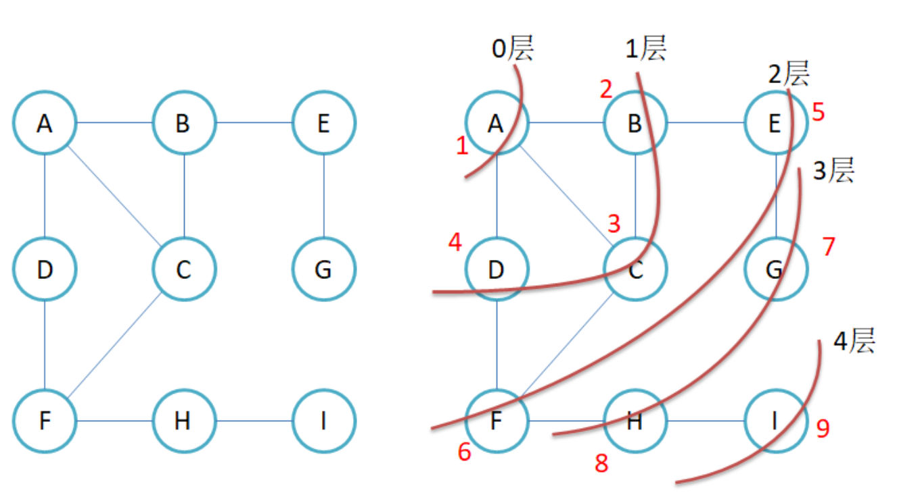

# 图

1. 图的基本概念

2. 图的存储结构

3. 图的遍历

4. 最小生成树

5. 最短路径

## 图的基本概念

一般表示成 G = (V, E)。

## 图的表示方法

1. 邻接矩阵

2. 邻接表

### 邻接矩阵

邻接矩阵存储方式非常适合稠密图。邻接矩阵可以O(1)判断两个顶点的连接关系，并拿到权值。

邻接矩阵不适合用来查找，一个顶点连接的所有边，这个是O(n)的。

邻接矩阵的表示：

```cpp
namespace yufc_graph_matrix
{
    template <class vertex_type, class weight_type, weight_type __max_weight = INT_MAX, bool direction = false>
    class graph
    {
    private:
        std::vector<vertex_type> __vertexs;             // 顶点的集合
        std::map<vertex_type, int> __index_map;         // 顶点映射的下标
        std::vector<std::vector<weight_type>> __matrix; // 邻接矩阵
    public:
        // 图的创建
        /*
            三种创建图的方法：
            1. IO输入 -- 不方便测试，oj中更合适
            2. 图结构关系写到文件，读取文件
            3. 手动添加边
        */
        graph(const vertex_type *a, size_t n)
        {
            __vertexs.reserve(n);
            for (size_t i = 0; i < n; i++)
            {
                __vertexs.push_back(a[i]); // 每个顶点存进去
                __index_map[a[i]] = i;     // 顶点映射的下标，就是这个顶点是__vertexs中哪一个下标上的
            }
            __matrix.resize(n);
            for (size_t i = 0; i < __matrix.size(); ++i)
            {
                __matrix[i].resize(n, __max_weight);
            }
        }
        size_t get_vertex_index(const vertex_type &v)
        {
            /* 确定顶点的下标 */
            auto it = __index_map.find(v);
            if (it != __index_map.end())
                return it->second;
            else
            {
                throw std::invalid_argument("vertex not exists");
                return -1;
            }
        }
        void add_edge(const vertex_type &src, const vertex_type &dest, const weight_type &weight)
        {
            size_t srci = get_vertex_index(src);
            size_t desti = get_vertex_index(dest);
            __matrix[srci][desti] = weight;
            // 如果是无向图
            if (direction == false)
                __matrix[desti][srci] = weight;
        }

    public:
        void print()
        {
            // 把顶点打印出来
            for (size_t i = 0; i < __vertexs.size(); i++)
                std::cout << "[" << i << "]"
                          << "->" << __vertexs[i] << std::endl;
            std::cout << std::endl;
            // 打印一下矩阵
            // 先打印一下下标
            std::cout << "  ";
            for (size_t i = 0; i < __vertexs.size(); ++i)
                std::cout << i << " ";
            std::cout << std::endl;
            for (size_t i = 0; i < __matrix.size(); ++i)
            {
                // 先打印一下下标
                std::cout << i << " ";
                for (size_t j = 0; j < __matrix[i].size(); ++j)
                    if (__matrix[i][j] == __max_weight)
                        std::cout << "* ";
                    else
                        std::cout << __matrix[i][j] << " ";
                std::cout << std::endl;
            }
        }
    };
}
```

### 邻接表

邻接表是一个指针数组，把自己连接的顶点都挂在下面。

适合存储稀疏图。适合查找一个顶点连接出去的边。

不适合确定两个顶点是否相连，及其权值

邻接表的表示：

```cpp
namespace yufc_graph_link_table
{
    template <class weight_type>
    struct edge
    {
        int __dest_idx;            // 目标点的下标
        weight_type __weight;      // 权值
        edge<weight_type> *__next; // 链接指针
        edge(int desti, const weight_type &weight)
            : __dest_idx(desti), __weight(weight), __next(nullptr) {}
    };
    template <class vertex_type, class weight_type, bool direction = false>
    class graph
    {
    private:
        typedef edge<weight_type> Edge;
        std::vector<vertex_type> __vertexs;     // 顶点的集合
        std::map<vertex_type, int> __index_map; // 顶点映射的下标
        std::vector<Edge *> __table;            // 下面挂边
    public:
        graph(const vertex_type *a, size_t n)
        {
            __vertexs.reserve(n);
            for (size_t i = 0; i < n; i++)
            {
                __vertexs.push_back(a[i]); // 每个顶点存进去
                __index_map[a[i]] = i;     // 顶点映射的下标，就是这个顶点是__vertexs中哪一个下标上的
            }
            // 初始化邻接表
            __table.resize(n, nullptr);
        }
        size_t get_vertex_index(const vertex_type &v)
        {
            /* 确定顶点的下标 */
            auto it = __index_map.find(v);
            if (it != __index_map.end())
                return it->second;
            else
            {
                throw std::invalid_argument("vertex not exists");
                return -1;
            }
        }
        void add_edge(const vertex_type &src, const vertex_type &dest, const weight_type &weight)
        {
            size_t srci = get_vertex_index(src);
            size_t desti = get_vertex_index(dest);
            Edge *eg = new Edge(desti, weight);
            // 头插
            eg->__next = __table[srci];
            __table[srci] = eg;
            if (direction == false)
            {
                // 无向图反过来还要弄一下才行
                Edge *eg = new Edge(srci, weight);
                eg->__next = __table[desti];
                __table[desti] = eg;
            }
        }

    public:
        void print()
        {
            // 把顶点打印出来
            for (size_t i = 0; i < __vertexs.size(); i++)
                std::cout << "[" << i << "]"
                          << "->" << __vertexs[i] << std::endl;
            std::cout << std::endl;
            //
            for (size_t i = 0; i < __table.size(); ++i)
            {
                std::cout << __vertexs[i] << "[" << i << "]->";
                Edge *cur = __table[i]; // 遍历一下单链表而已
                while (cur)
                {
                    std::cout << cur->__weight << "->" << __vertexs[cur->__dest_idx] << "[" << cur->__dest_idx << "]->";
                    cur = cur->__next;
                }
                std::cout << "nullptr" << std::endl;
            }
        }
    };
}
```


### 图的一些相关概念

完全图：在有n个顶点的无向图中，若有$n*(n-1)/2$条边，即任意两个顶点之间有且仅有一条边，则称此图为无向完全图。在n个顶点的有向图中，若有$n*(n-1)$条边，即任意两个顶点之间有且仅有方向相反的边，则称此图为有向完全图。

邻接顶点：在无向图中G中，若(u, v)是E(G)中的一条边，则称u和v互为邻接顶点，并称边(u,v)依附于顶点u和v;在有向图G中，若`<u, v>`是E(G)中的一条边，则称顶点u邻接到v，顶点v邻接自顶点u，并称边`<u, v>`与顶点u和顶点v相关联。

顶点的度：顶点v的度是指与它相关联的边的条数，记作deg(v)。在有向图中，顶点的度等于该顶点的入度与出度之和，其中顶点v的入度是以v为终点的有向边的条数，记作`indev(v)`;顶点v的出度 是以v为起始点的有向边的条数，记作`outdev(v)`。因此:`dev(v) = indev(v) + outdev(v)`。注意：对于无向图，顶点的度等于该顶点的入度和出度，即`dev(v) = indev(v) = outdev(v)`。

路径：在图G = (V, E)中，若从顶点vi出发有一组边使其可到达顶点vj，则称顶点vi到顶点vj的顶 点序列为从顶点vi到顶点vj的路径。

路径长度：对于不带权的图，一条路径的路径长度是指该路径上的边的条数；对于带权的图，一条路径的路径长度是指该路径上各个边权值的总和。

简单路径与回路：若路径上各顶点v1，v2，v3，...，vm均不重复，则称这样的路径为简单路径。若路径上第一个顶点v1和最后一个顶点vm重合，则称这样的路径为回路或环。

子图:设图G = {V, E}和图G1 = {V1，E1}，若V1属于V且E1属于E，则称G1是G的子图。

连通图：在无向图中，若从顶点v1到顶点v2有路径，则称顶点v1与顶点v2是连通的。如果图中任意一对顶点都是连通的，则称此图为连通图。

强连通图：在有向图中，若在每一对顶点vi和vj之间都存在一条从vi到vj的路径，也存在一条从vj到vi的路径，则称此图是强连通图。

生成树：一个连通图的最小连通子图称作该图的生成树。有n个顶点的连通图的生成树有n个顶点和n-1条边。


**#BUG: 0206发现潜在问题：如果一直给无向图add_edge，重复的边权值矛盾了怎么处理，要记得处理一下（还未处理）**

## 图的遍历

两种遍历针对的都是图的顶点。

### bfs

广度优先遍历，然后我们都用这个图。



第一次先把A入队列。

此时队列为：`A`

然后A出来，把和A相连的带进来（BCD）。

此时队列为：`B C D`

此时B出来，把和B相连的带进来，和B相连的有E，C，A。不用说，E肯定是要进来的，AC进不进队列呢？

A不要进了，C可以进，因为此时C还没有被访问过。这时候虽然队列里面有两个C，但是也没问题，到时候的访问过的节点，不要再去访问就行了。

然后怎么标记呢，可以用一个set去记录一下下标（元素可能是其他类型，不好搞，所以就记录下标就行了）

**当然可以不这样标记也可以，我们可以把进队列的标记一下，这样效率高一点**

代码如下所示：
```cpp
void bfs(const vertex_type &src)
{
    // 需要给一个起点
    size_t srci = get_vertex_index(src); // 找到起点的下标
    std::queue<int> q;
    std::vector<bool> visited(__vertexs.size(), false); // 所有顶点一开始先标记成false
    q.push(srci);                                       // 起点入队列
    visited[srci] = true;                               // 标记起点，因为起点已经入队列了
    while (!q.empty())
    {
        // 队列不为空就继续遍历
        int front = q.front();                                             // 队头的数据
        std::cout << __vertexs[front] << "[" << front << "]" << " "; // 访问这个值
        q.pop();
        // 把和front相连的顶点入队
        for (size_t i = 0; i < __vertexs.size(); ++i)
        {
            if (__matrix[front][i] != __max_weight && visited[i] == false)
            {
                q.push(i);         // 和当前顶点相连的节点
                visited[i] = true; // 入队列的，标记一下
            }
        }
    }
    std::cout << std::endl << "bfs done!" << std::endl;
}
```
输出：
```
A[0] B[1] C[2] D[3] E[4] F[5] G[6] H[7] I[8] 
bfs done!
```
这个也符合我们的预期。

同时，我们也可以给这个bfs进行改进，因为做力扣的时候是有一个二叉树的层序遍历的题目的，如果我想知道每一层分别是什么，我们在代码中也可以控制，下面是改进后的版本。


```cpp
// 遍历
void bfs(const vertex_type &src)
{
    // 需要给一个起点
    size_t srci = get_vertex_index(src); // 找到起点的下标
    std::queue<int> q;
    std::vector<bool> visited(__vertexs.size(), false); // 所有顶点一开始先标记成false
    q.push(srci);                                       // 起点入队列
    visited[srci] = true;                               // 标记起点，因为起点已经入队列了
    int levelSize = 1;
    while (!q.empty())
    {
        // 控制一次出一层
        for (size_t i = 0; i < levelSize; i++)
        {
            // 队列不为空就继续遍历
            int front = q.front(); // 队头的数据
            std::cout << __vertexs[front] << "[" << front << "]"
                        << " "; // 访问这个值
            q.pop();
            // 把和front相连的顶点入队
            for (size_t i = 0; i < __vertexs.size(); ++i)
            {
                if (__matrix[front][i] != __max_weight && visited[i] == false)
                {
                    q.push(i);         // 和当前顶点相连的节点
                    visited[i] = true; // 入队列的，标记一下
                }
            }
        }
        std::cout << std::endl; // 出完每一层才去换行
        levelSize = q.size();   // 此时levelSize就是下一层个数，就是现在队列的元素个数，因为我们已经把当前层出完了，剩下的都是下一层的
    }
    std::cout << "bfs done!" << std::endl;
}
```
输出：
```
A[0] 
B[1] C[2] D[3] 
E[4] F[5] 
G[6] H[7] 
I[8] 
bfs done!
```
这样的结果也是符合预期的。